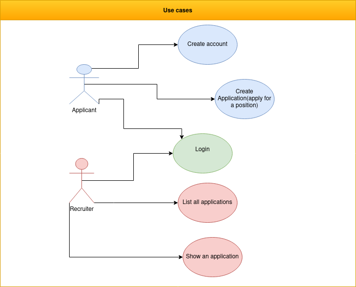
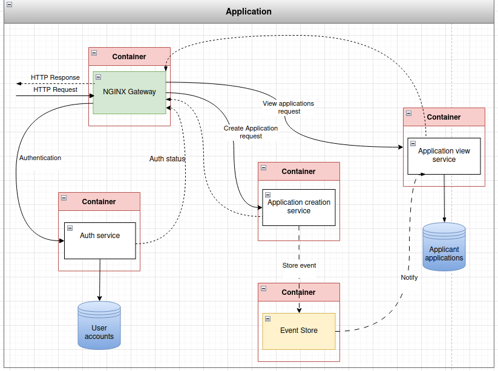

# Recruitment App

This is a repository for a backend microservice application that I created as a part of my bachelors thesis work. 

The application is a simple mock application using mock data. The application is a for a hypothetical amusement park where job seekers can send in their job-application with their relevant credentials, and recruiters and can view these job-applications. Job seekers must register, then login and create a job-application to send in. Recruiter accounts can only be created through administrators who have root access to the databases. Recruiters must login before they can view job-applications. Recruiters can view job-application one-by-one or retrieve a list of a certain number of job-applications. 

below is a simple use-case diagram: 

## The Microservices

The application consists of four microservices: a NGINX gateway, an authentication service, a job-application creation service, a job-application viewing service.

The NGINX gateway routes incoming requests to the appropriate microservice. If authentication is required for accessing a microservice the gateway internally makes an HTTP request to the authentication server and if authentication is successfull forwards the initial request to the initially requested microservice. The authentication microservice is also used for registering job-applicants, and for logging in applicants and recruiters. 

The authentication microservice is used for registering job-applications and logging in job-applicants and recruiters, as well as for authenticating incoming requests for the job-application creation microservice and the job-application view microservice. The authentication microservice has its own database with job-applicant and recruiter accounts. Authentication is performed through JWT using a unique token, when a user logs in they receive a JWT cookie which is valid for 30 minutes. The authentication process includes checking if the user account exists at all in the database, then we check if they have the correct role for accessing the microservice, ie a user needs to be a recruiter to be able to access the job-application view microservice. And finally the the JWT cookie goes through a verification check, if all stages pass then the user is considered verified. 

The job-application creation microservice is used for creating job-applications by job-applicants. A user needs to be verifyed as a job-applicant to have access to this service. When a job application is created it is added to an event queue which notifies the job-application view microservice of the event. 

The job-application view microservice is used by recruiters to view job-applications. A user needs to be verified as a recruiter to be granted access to this microservice. This microservice also contains the database of job-applications. It is notified by the event queue of recently created job-applications which are then added to the database. 

Below is an architectural diagram of the application: 

